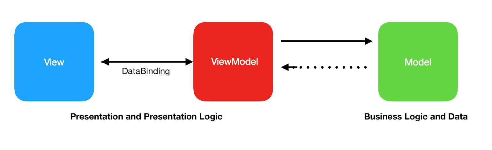

# News Summary challenge

Please see full detail of the [News Summary challenge](https://github.com/bmoishe/news-summary-challenge).

# Approach
I started to plan the project by making User stories into CRC cards. See bellow:

User Stories:

```
As a busy politician
I can see all of today's headlines in one place
So I know what the big stories of the day are
```

```
As a busy politician
I can click a link to see the original news article
So that I can get an in depth understanding of a very important story

```

```
As a busy politician
I can see a summary of a news article
So I can get a few more details about an important story
```

```
As a busy politician
I can see a picture to illustrate each news article when I browse headlines
So that I have something nice to look at
```

```
As a busy politician
I can read the site comfortably on my phone
Just in case my laptop breaks
```

```
As a busy politician
I can see whizzy animations in the app
To make my news reading more fun
```

CRC cards:

- see_all_headlines:  - Pull in headlines of the API

- see_a_summary: - Create a function for this

- see a picture: picture - Pull in an API for the pictures of the article

- see the original news article (link): link - Pull in a link for the news article

PLAN:

I decided to use the MVVC model


I used a get request to access the [Guardian newspaper API](http://open-platform.theguardian.com/documentation/) and retrieve headlines, images and URLs of articles. I then created a function to summaries the information on the page.

I separated my Business logic to use data collected from the API.

I used an interface file (View Model) to call on the business logic and Data in order to populated the page.

The page (View) simply requires the View Model host the CSS and HTML.

TDD:

I began by using a testing framework we created earlier in the week when we created a ['Notes application'](https://github.com/PreetiSekhon2/NoteWorthy) as a team. [Amiee Craig](https://github.com/aimeecraig) was responsible for this testing framework so thank you.

In order to get todays headline from the [Guardian newspaper API](http://open-platform.theguardian.com/documentation/) I needed a function that would format the date correctly format (yyyy/mm/dd).

I also required a function to summarise the body text that I retrieved for this API.

I first built the required tests to fail, created the code to pass and then refactored this code.
